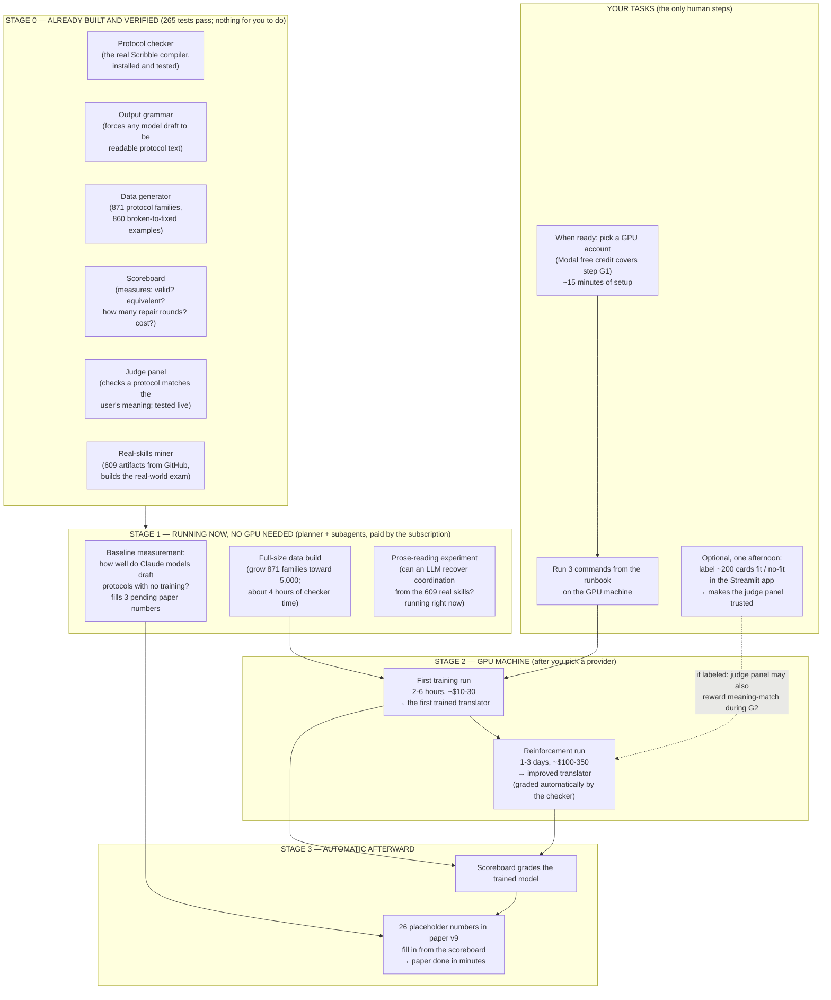

# Training roadmap — who does what, in what order

<!-- MENU:START (auto-generated — edit headings, then regenerate) -->
## Menu

- [The same thing as a checklist](#the-same-thing-as-a-checklist)
<!-- MENU:END -->

One page, no insider terms. The goal: train a model that turns a
plain-language request (the "intent") into a formal coordination
contract between agents (the "global protocol") that the Scribble
checker accepts and that means what the user meant.

## The same thing as a checklist

| # | step | who | effort / cost | what comes out |
|---|---|---|---|---|
| 0 | build all instruments | done (this week) | already paid | everything in Stage 0, audited |
| 1 | baseline measurement | planner + subagents | subscription | 3 pending paper numbers (how good is un-trained drafting) |
| 2 | full data build | sandbox computer | ~4 h, free | training set at full size |
| 3 | prose-reading experiment | subagent (running) | subscription | answers "is coordination absent from real skills, or just implicit?" |
| 4 | label ~200 cards | **you** (optional) | one afternoon | judge panel becomes a trusted measure of meaning-match |
| 5 | pick GPU provider | **you** | 15 min; Modal's free credit covers step 6 | account ready |
| 6 | first training run | GPU | 2–6 h, ~$10–30 | the first trained intent→protocol model |
| 7 | reinforcement run | GPU | 1–3 days, ~$100–350 | improved model, graded by the checker |
| 8 | fill the paper | automatic | minutes | paper v9 numbers complete |

Two clarifications people usually want:

- **Steps 6–7 need no API key and no human labels.** The grader is the
  Scribble checker running on the GPU machine itself. Your labels
  (step 4) only decide whether the judge panel is additionally allowed
  to reward meaning-match in step 7 — skipping step 4 skips only that.
- **Nothing in steps 1–3 costs you anything or blocks on you.** They
  run on the subscription and the sandbox while you decide about GPU.
